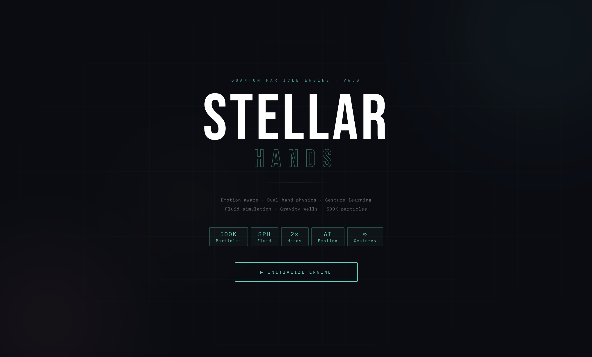
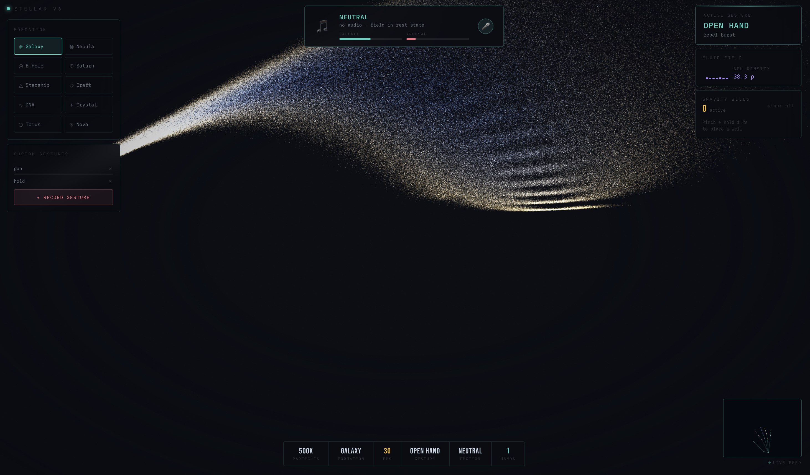
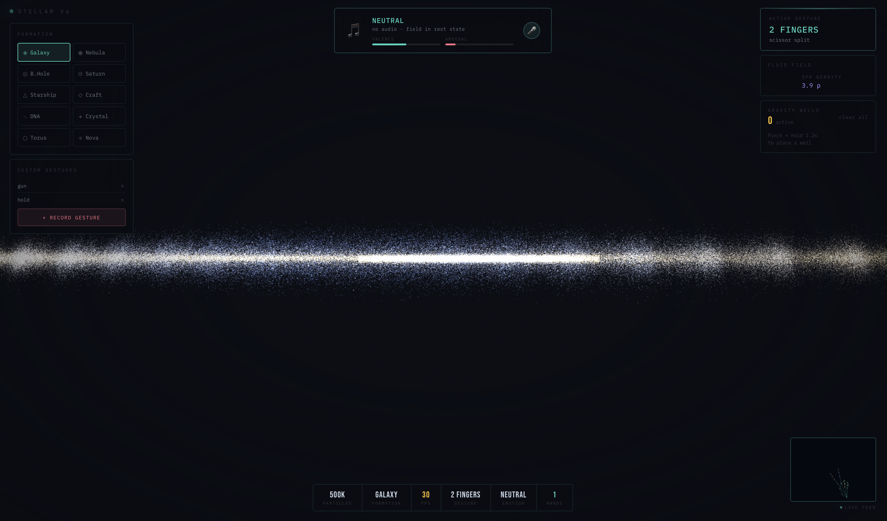
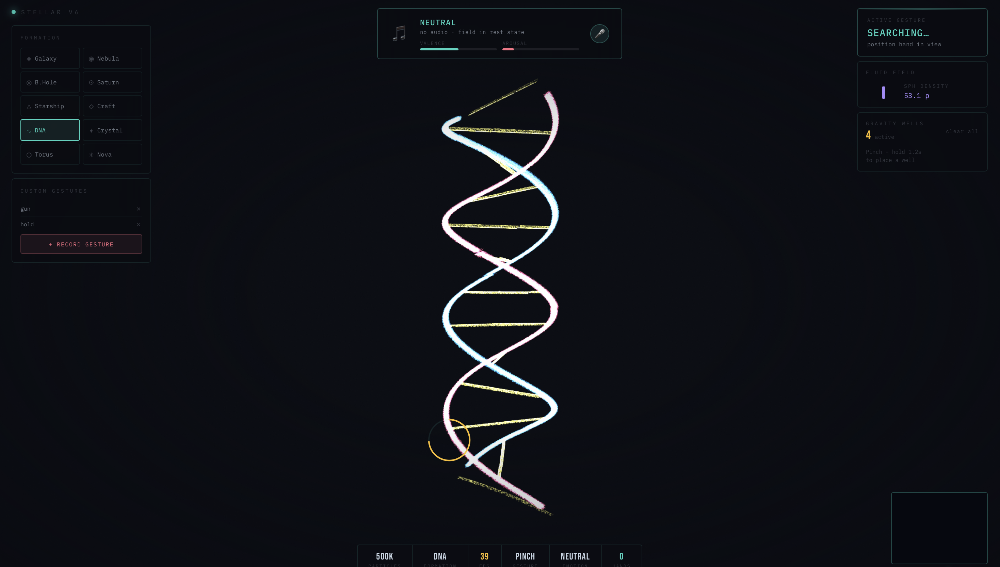
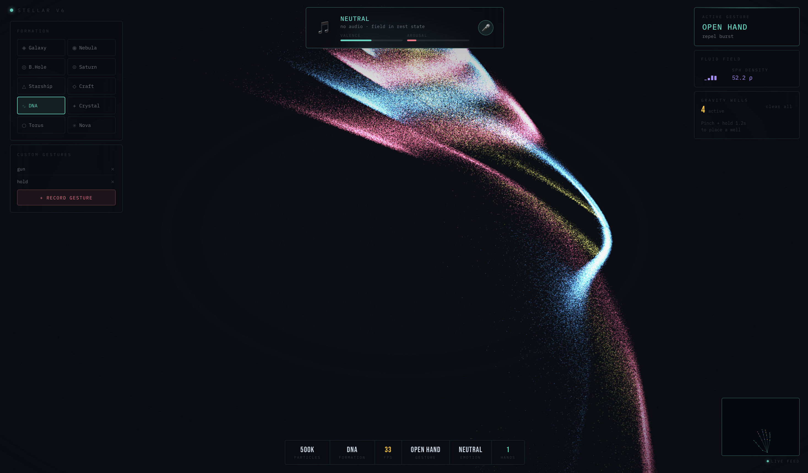

<div align="center">

<h1>✦ STELLAR</h1>

**GPU-accelerated hand-tracked particle field engine — entirely in the browser**

[](./LICENSE)
[](./stellar_handsv3.2.html)
[](./stellar_handsv3.2.html)
[](https://threejs.org)
[](https://google.github.io/mediapipe/solutions/hands)
[](https://www.khronos.org/webgl/)

<br/>  

*500,000 particles. 8 gestures. 10 formations. Zero dependencies beyond a webcam.*

<br/>


[**Live Demo**](#) &nbsp;·&nbsp; [**Report Bug**](https://github.com/ayuuXploits/stellar/issues) &nbsp;·&nbsp; [**Request Feature**](https://github.com/ayuuXploits/stellar/issues)

<br/>



<br/>

 &nbsp; 
 &nbsp; 

</div>

---

## 📋 Table of Contents

- [Overview](#-overview)
- [Features](#-features)
- [Gesture Reference](#-gesture-reference)
- [Formations](#-formations)
- [Tech Stack](#-tech-stack)
- [Getting Started](#-getting-started)
- [Project Structure](#-project-structure)
- [Configuration](#-configuration)
- [Browser Support](#-browser-support)
- [License](#-license)

---

## 🌌 Overview

**STELLAR** is a GPU-accelerated particle field engine that uses your webcam and AI hand-pose estimation to interact with 500,000 real-time particles rendered via WebGL. Point, pinch, slash, or freeze the field — each gesture triggers a distinct physics behaviour on the particle system.

The entire engine — renderer, physics, AI tracking, and UI — lives in a single HTML file. No backend. No npm. No build step. Open the file and go.

---

## ✨ Features

| Category | Detail |
|----------|--------|
| 🌠 **Particles** | 500,000 live particles with additive blending via WebGL |
| 🤌 **Hand Tracking** | 8 gestures mapped to unique particle physics via MediaPipe Hands |
| 🪐 **Formations** | 10 cosmic formations — Galaxy, Nebula, Black Hole, Saturn, DNA, Crystal, Torus, Supernova, Starship, Spacecraft |
| 🖱️ **Mouse Fallback** | Fully interactive without a webcam |
| ⚡ **Slash Detection** | Fast swipe recognition triggers a particle shockwave |
| ✊ **Hold-to-Freeze** | Hold a fist to suspend the entire field in place |
| 🦴 **Skeleton Overlay** | Live hand skeleton in the camera preview with per-finger colouring |
| 🎞️ **Film Overlays** | Grain + vignette post-processing for a cinematic aesthetic |

---

## 🤌 Gesture Reference

| Gesture | Name | Physics Effect |
|---------|------|----------------|
| ✊ | **Fist** | **Implode** — collapse particles toward the hand position |
| 🤏 | **Pinch** | **Attract** — draw particles steadily inward |
| ☝️ | **1 Finger** | **Laser** — horizontal pierce beam through the field |
| ✌️ | **2 Fingers** | **Scissor** — split the field left and right |
| 🖐️ | **Open Hand** | **Repel** — burst particles outward from the palm |
| 👌 | **OK Sign** | **Vortex** — orbital spin around the hand position |
| ⏸️ | **Hold Fist** | **Freeze** — suspend the entire field mid-motion |
| ⚡ | **Slash** | **Shockwave** — fast swipe cuts a pressure wave through the field |
 
---

## 🪐 Formations

| Formation | Description |
|-----------|-------------|
| **Galaxy** | 5-arm spiral with core density gradient |
| **Nebula** | 6-lobe emission cloud with shifting hues |
| **Black Hole** | Accretion disc + polar jets + event horizon ring |
| **Saturn** | Layered ring bands with axial tilt |
| **Starship** | Cylindrical hull, nacelles, and engine exhaust plume |
| **Spacecraft** | Fuselage + delta wings + thruster glow |
| **DNA** | Double helix with rungs and strand colour coding |
| **Crystal** | Faceted multi-cluster growth |
| **Torus** | Torus knot (3,2) parametric curve |
| **Supernova** | Expanding shell + disc remnant + compact core |

---

## 🛠️ Tech Stack

| Layer | Technology |
|-------|------------|
| **Rendering** | [Three.js r128](https://threejs.org/) — WebGL `BufferGeometry` particle system |
| **Hand Tracking** | [MediaPipe Hands](https://google.github.io/mediapipe/solutions/hands) — 21-landmark AI model |
| **Physics** | Custom spring + damping system (vanilla JS, runs on CPU) |
| **Typography** | [Syne](https://fonts.google.com/specimen/Syne) + [DM Mono](https://fonts.google.com/specimen/DM+Mono) |
| **Build** | None — single self-contained HTML file |

---

## 🚀 Getting Started

### Prerequisites

- A modern browser with **WebGL support** (Chrome / Edge recommended)
- A **webcam** — optional, mouse fallback works automatically

### Run Locally

```bash
git clone https://github.com/ayuuXploits/stellar.git
cd stellar
```

**Option A — open directly** *(mouse fallback only)*

```bash
open stellar_handsv3.2.html
```

**Option B — serve locally** *(enables webcam)*

```bash
npx serve .
# visit http://localhost:3000

```

> **Note:** Webcam access requires a secure context (`https://` or `localhost`). Opening via `file://` automatically falls back to mouse mode.

---

## 📁 Project Structure

```
stellar/
├── stellar_handsv3.2.html      # ← Latest build — full engine (renderer, AI, UI, physics)
├── stellar_hands_v3.1.html     # Previous build
├── stellar_v3.html             # Pre-hands version
├── stellar_v2.html             # Early prototype
├── stellar.html                # first prototype
├── docs/
│   ├── stellar_hands.png
│   ├── stellar_hands1.png
│   ├── stellar_hands2.png
│   ├── stellar_hands3.png
│   └── stellar_hands4.png
├── .gitignore
├── LICENSE
└── README.md
```

> The entire engine is self-contained in `stellar_handsv3.2.html`. All Three.js and MediaPipe dependencies are loaded from CDN — no local install needed.

---

## 🎛️ Configuration

Key constants at the top of the `<script>` block in `stellar_handsv3.2.html`:

```js
const COUNT   = 500_000;  // Particle count — reduce to ~100k on slower devices
const DAMPING = 0.938;    // Velocity decay per frame (0 = instant stop, 1 = no decay)
const SPRING  = 0.0065;   // Return-to-formation strength (higher = snappier)

```

**Performance tuning guide:**

| Device | Recommended `COUNT` |
|--------|---------------------|
| High-end desktop (dedicated GPU) | `500_000` |
| Mid-range laptop | `200_000` |
| Integrated graphics / mobile | `50_000 – 100_000` |

---

## 🌐 Browser Support

| Browser  | Minimum Version | Notes |
|---------|----------------|-------|
| Chrome / Edge | 110+ | Recommended — best WebGL performance |
| Firefox | 115+ | Supported |
| Safari | 16.4+ | Supported; webcam requires user gesture |

**Required browser APIs:**
- `WebGL2` — particle rendering
- `MediaDevices.getUserMedia` — webcam input
- `OffscreenCanvas` / `<canvas>` — frame processing

---

## 📄 License

**Copyright © 2026 [ayuuXploits](https://github.com/ayuuXploits). All Rights Reserved.**

No part of this project — including source code, design, assets, or formations — may be reproduced, distributed, modified, or used in any form without explicit written permission from the author.

---

<div align="center">

Made with ✦ by [ayuuXploits](https://github.com/ayuuXploits)

</div>
